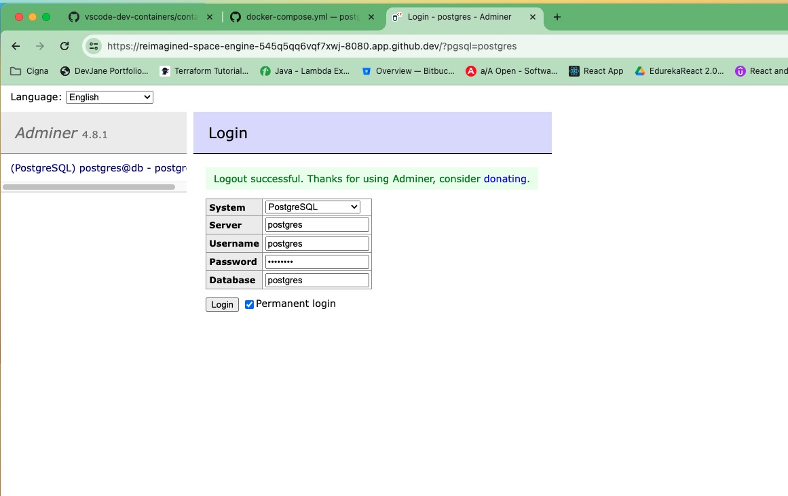

# postgres-docker-compose-dev
1. create postgres sql db instance on docker 2. enable pgadmin4 to access postgres sql 3: use can clone the db and access the database instance

## adminer Login

## adminer Home Page

